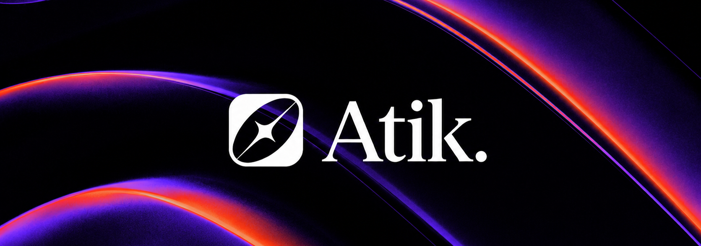
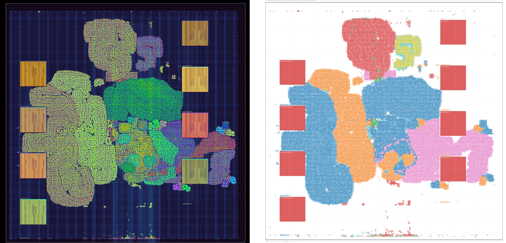
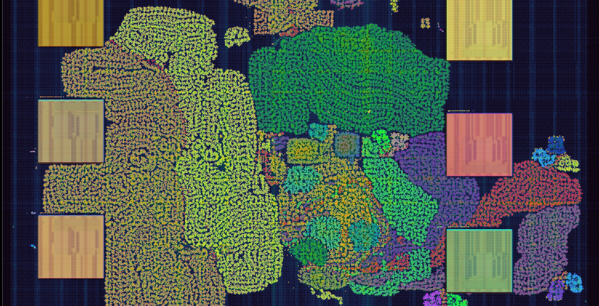

## TL;DR
**Atik** is an open-source AI Accelerator Hardware.

*What makes it so special?* Here 👇

✅ **Attention** mechanism smelted directly into silicon  
✅ Prototyped end-to-end on **FPGA** (AWS F2)  
✅ Benchmarked against **PyTorch**-based workloads  
✅ Built on the **RocketChip** architecture (RISC-V)  
✅ Native **BF16** support  
✅ Up to **100×** speedup on vanilla attention  
✅ Up to **80×** speedup on TinyBERT  
✅ Up to **30×** speedup on GPT-2 prefill  

- Don't believe benchmark results? Click to watch the [playlist](https://www.youtube.com/playlist?list=PL6v0daaIvQGvxYVnezbRdfBysHe-s8BjE).
- Want to simulate it locally? Check out this video. *(Coming soon)*

*From here upon nerdy people can continue reading :)*



## Why Atik ?
There's definitely a growing interest in academia around Attention accelerators, rivaling the interest in systolic hardware. But honestly, a lot of the current research feels a bit too theoretical. Some of it relies purely on C++ simulators like gem5, lacking time-accurate simulation or a proper VLSI flow. Otherwise, it tends to be closed-source, or a standalone ASIC implementation that doesn't really integrate with standard CPU workloads. 

The mature, open-source DNN accelerators we already have—like NVDLA and Gemmini—are starting to feel a bit legacy. They were beautifully built for the needs of their time, optimizing for CNNs and vision tasks, but they don't support Attention mechanisms. Plus, they focus on quantized datatypes like INT8, which just isn't ideal for modern day-to-day applications that rely so heavily on BF16. 

Standard vector units simply aren't cutting it anymore. With transformers being adopted everywhere, we really need systolic arrays working right alongside Softmax modules to finally tackle those heavy attention workloads. 

To bring it all together: what the open-source hardware community truly needs right now is a dedicated Attention and MatMul accelerator. It needs to support BF16 natively, sit on top of a robust computer architecture like RocketChip, be easily benchmarked against modern PyTorch workloads, and be fully ready for FPGA prototyping.

This is the gap **Atik** is trying to fill. A modern opensource Tightly-Coupled AI accelerator. FPGA-prototypable. VLSI-verified. Preparing for someone to tape it out! 


## How Speedup Is Calculated

For the standalone matmul and attention benchmarks, speedup is measured by running the same kernel twice: once with the software BF16 reference implementation and once with Atik. Both paths are timed with the RISC-V cycle counter, and the hardware result is also checked against the software output.

```c
const uint64_t cpu_start = atik_bench_read_cycles();
atik_ref_matmul_bf16(...);
const uint64_t cpu_cycles = atik_bench_read_cycles() - cpu_start;

atik_clear_counters();
atik_matmul_bf16(...);
const uint64_t hw_cycles = atik_read_counter(ATIK_COUNTER_TOTAL_CYCLES);
```

For the PyTorch-derived workloads, running the full model twice would be unnecessarily expensive. Instead, the benchmark profiles the full CPU workload, separately profiles the parts replaced by Atik, and estimates the accelerated workload as:

```text
accelerated_cycles = cpu_total_cycles - cpu_replaced_cycles + hw_replacement_cycles
```

This keeps the comparison cycle-based while avoiding repeated full-model replays. The implementation lives in [`software/src/pytorch_workload.c`](software/src/pytorch_workload.c), especially the `hybrid_cycles` accounting path.

## Architecture

Atik is a RoCC-attached accelerator. Software describes an operation with an `atik_desc_t`, sends the descriptor address with `set_desc`, and starts execution with `run`. Hardware fetches that descriptor, decodes whether the operation is matmul, attention, or causal attention, and dispatches to the matching controller.

Both matmul and attention use explicit DMA, local SRAM-backed tile buffers, BF16-to-fixed conversion, a shared fixed-point MAC mesh, and BF16 writeback. Matmul uses the mesh for `C += A * B`; attention reuses the same mesh for both QK score computation and probability-times-V accumulation, with scalar-scheduled softmax, reciprocal, and normalization around it.

The deeper design notes are kept in [`manifest/architecture.md`](manifest/architecture.md). The end-to-end operation flows are documented in [`manifest/scenarios/matmul.md`](manifest/scenarios/matmul.md) and [`manifest/scenarios/attention.md`](manifest/scenarios/attention.md).

## Time & Cycle Accurate Simulation On FPGA

Atik is integrated with FireSim for cycle-accurate FPGA simulation on AWS F2. The FireSim configuration files under [`firesim/`](firesim/) describe the build recipes, hardware database entries, and deployment setup for the 2x2, 4x4, and 8x8 RoCC configurations.

Prebuilt AGFI entries are listed in [`firesim/config_hwdb.yaml`](firesim/config_hwdb.yaml). Fresh images can be rebuilt from the recipes in [`firesim/config_build_recipes.yaml`](firesim/config_build_recipes.yaml) and selected through [`firesim/config_build.yaml`](firesim/config_build.yaml). In practice, this means the same Chisel design can be taken from source to a FireSim image and benchmarked with the software workloads in this repository.

## Benchmark Results

## Benchmark Videos

## VLSI Flow


Atik also includes a Hammer/OpenROAD flow for standalone `AtikCore` synthesis experiments. The current scripts target the accelerator core rather than a full RocketTile or ChipTop, which keeps the flow focused on the accelerator datapath, controllers, DMA logic, and local buffering. The launch scripts and Sky130/OpenROAD configuration live under [`vlsi/hammer/`](vlsi/hammer/), and the latest synthesis summary is kept in [`vlsi/syn.rpt`](vlsi/syn.rpt).

| Metric | 2x2 normal | 4x4 normal | 8x8 normal |
|---|---:|---:|---:|
| Config | `Atik2x2RoCCConfig` | `Atik4x4RoCCConfig` | `Atik8x8RoCCConfig` |
| Mesh size | 2x2 | 4x4 | 8x8 |
| MAC lanes | 4 | 16 | 64 |
| Top synthesized cells | 114,575 | 190,722 | 477,464 |
| Top synthesized area | 721,211.7 | 1,217,183.6 | 3,130,859.0 |
| Area per MAC lane | 180,302.9 | 76,074.0 | 48,919.7 |

The area scales with mesh size, but the area per MAC lane improves as the fixed control and DMA overheads are amortized across more lanes. This is the expected behavior for a design where the descriptor path, counters, scalar softmax units, and tile DMA logic are shared around a larger mesh.

| Module | 2x2 area | 4x4 area | 8x8 area |
|---|---:|---:|---:|
| `AttentionController` | 192,507.1 | 232,010.0 | 369,431.8 |
| `MatmulController` | 127,462.2 | 133,305.4 | 154,623.3 |
| `AttentionScalarMul` | 99,010.0 | 99,010.0 | 99,010.0 |
| `TileDmaReader` | 81,989.9 | 81,942.3 | 81,908.6 |
| `TileDmaWriter` | 5,700.5 | 9,265.1 | 17,186.5 |

The largest blocks are the attention and matmul controllers, followed by the shared scalar multiply path and tile DMA reader. Some blocks, such as `AttentionScalarMul` and `TileDmaReader`, stay nearly constant across mesh sizes because they are shared infrastructure rather than per-lane compute.

## Tutorial Videos

## Project Timeline

Atik is the current version of the project. It is a modular, synthesizable, RoCC-attached AI accelerator with BF16 matmul and online attention support, explicit DMA, SRAM-backed tile buffers, shared mesh compute, FireSim integration, and a standalone VLSI flow.

The previous major branch is `girdap`. That version explored a larger accelerator structure with separate attention and matmul paths. It helped validate the direction, but the design was harder to synthesize, less modular, and carried more integration complexity than the current shared-mesh Atik architecture.

Before that, the `toyrocc` branch contained early RoCC experiments and prototype softmax/attention modules. Those pieces were useful for learning the control and numerical problems, but they were not organized as the current reusable, module-level accelerator design.

## Acknowledgment

Atik builds on the open-source RISC-V hardware ecosystem. Special thanks to UC Berkeley and the broader Chipyard community for Rocket Chip, RoCC integration patterns, and FireSim infrastructure. The project also depends on the Chisel/CHIPS Alliance toolchain, Hammer/OpenROAD VLSI flows, and the Sky130 open PDK ecosystem for the hardware generation and implementation path.

Historical versions of this work live in the `toyrocc` and `girdap` branches. Those experiments shaped the current Atik architecture, especially the move toward a cleaner shared-mesh accelerator with explicit DMA, SRAM-backed tiles, and a smaller software ABI.

## Citation

If you use Atik in academic work, please cite the repository:

```bibtex
@misc{atik,
  author = {Ahmed Zeer},
  title = {Atik: RoCC Based Transformer Accelerator},
  year = {2026},
  url = {https://github.com/AhmedZeer/atik}
}
```
